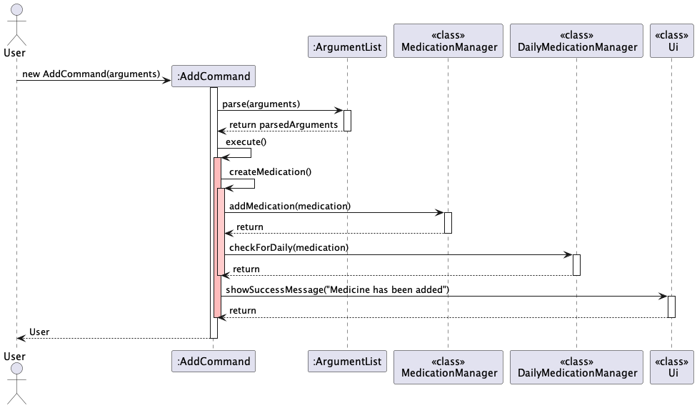
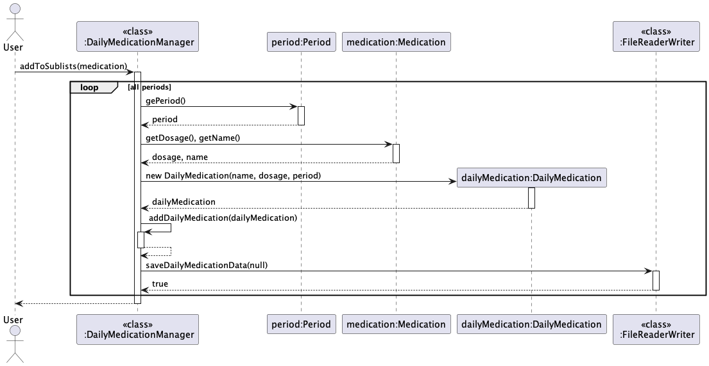
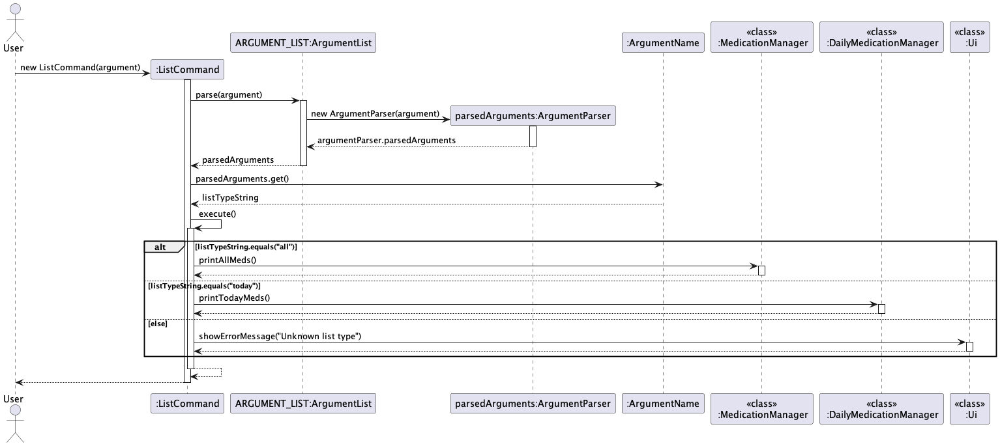
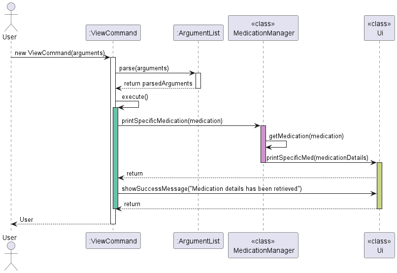
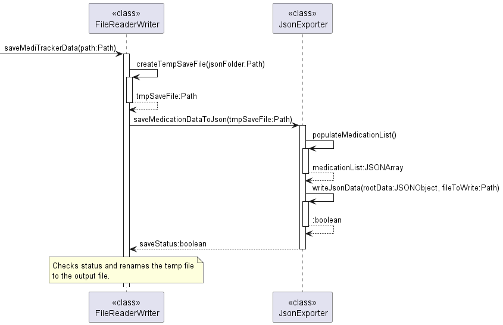

# Developer Guide

## Acknowledgements
Ideas and structure for our Developer Guide: 
- [AddressBook 3](https://se-education.org/addressbook-level3/DeveloperGuide.html)

Ideas and structure for the User Guide: 
- [AddressBook 3](https://se-education.org/addressbook-level3/UserGuide.html)

Additional Packages used: 
- [JSON](https://github.com/stleary/JSON-java)

# Overview
* [Setting up and getting started](#setting-up-and-getting-started)
* [Design & implementation](#design--implementation)
  * [Add Medication Command](#add-medication-command)
  * [Expanding Step 7](#expanding-step-7)
  * [List Medication Command](#list-medication-command)
  * [Utilising the Period and TimeRange](#utilising-the-period-and-timerange)
  * [View Medication Command](#view-medication-command)
  * [Search Medication Command](#search-medication-command)
  * [Utilising the argument parser](#utilising-the-argument-parser)
  * [Export to JSON File](#export-to-json-file)
  * [Simulated Time](#simulated-time)
* [Product scope](#product-scope)
  * [Target user profile](#target-user-profile)
  * [Value proposition](#value-proposition)
* [User Stories](#user-stories)
* [Non-Functional Requirements](#non-functional-requirements)
* [Glossary](#glossary)
* [Instructions for manual testing](#instructions-for-manual-testing)

## Setting up and getting started
### Setting up the project in your computer

:warning: <strong>Warning: </strong>

Follow the steps in the following guide precisely...

First, fork this [repo](https://github.com/AY2324S2-CS2113T-T09-1/tp), 
and clone the fork into your computer.

We highly recommend you to use Intellij IDEA.
1. **Configure the JDK**: Follow the 
[guide IDEA: Configuring the JDK](https://www.jetbrains.com/help/idea/sdk.html#set-up-jdk) 
to ensure Intellij is configured to use JDK 11.
2. **Import the project as a Gradle project**: Follow the 
[guide IDEA: Importing a Gradle project](https://se-education.org/guides/tutorials/intellijImportGradleProject.html) 
to import the project into IDEA.
3. **Verify the setup**: 
   1. meditracker.MediTracker and try a few commands.
   You can refer to our [UserGuide](UserGuide.md).
   2. Run the tests to ensure they all pass using Gradle.
      Open a console and run the command gradlew clean test (Mac/Linux: ./gradlew clean test)

## Design & implementation
<!-- Describe the design and implementation of the product. Use UML diagrams and short code snippets where applicable. -->

<!-- Comment: Perhaps add sequence diagram or class diagram here to show the interactions and relationships since this seems to involve quite a lot of classes? -->

### Add Medication Command
The add medication command extends from the Command parent class and implements the following operations:
- execute(MedicationManager, DailyMedicationManager, Ui) - Adds the medication object into the respective medication managers.
- setMedicineAttributes() - Sets the medicine object's attributes to be added to the medicine managers. 
- assertionTest(MedicationManager, DailyMedicationManager) - Asserts that medicine has been added to both medication managers.
- parseStringToValues(Arguments) - Parses string input for medicine quantity and dosage into double type.

Given below is an example usage scenario, along with the sequence diagram and how the add command behaves at each step:

- Step 1. User initiates the process.
- Step 2. `AddCommand` constructs an instance using the constructor `AddCommand(String arguments)` which includes 
parsing the arguments.
- Step 3. `ArgumentList` parses the provided arguments.
- Step 4. `AddCommand` calls `execute()` to add the medication.
- Step 5. Inside `execute()`, AddCommand calls `createMedication()` to construct a `Medication` object.
- Step 6. Adds the newly created `Medication` object to `MedicationManager`.
- Step 7. Checks and updates daily medication records in `DailyMedicationManager`.
- Step 8. `Ui` displays success or error messages to the user.

### Expanding Step 7

- Every medication is checked if they contain dosage for each `period` (morning, afternoon, evening) of the day.
- If `getDosage()` in each period is not null, then a new `dailyMedication` object is created with the `name`, `dosage` 
and `period` values.
- This `dailyMedication` is then added to the respective sub lists according to the `period`.
- Finally, the `dailyMedication` is saved into the text file and returns `true` if saved successfully.

---

### List Medication Command

The list medication command extends from Command parent class and contains the following methods:
- execute(MedicationManager medicationManager) - Executes the list command and performs its specific task, -t. 
- The task can be either `list -t all` to list all medications or `list -t today` to list medications for the day,
which is divided into three categories -> Morning, Afternoon and Evening.

**The 'list -t' command requires the following:**
- 'all' - to run printAllMedications() from the MedicationManager.

**The following commands print medications to be taken in a day:**
<!--Comment: Perhaps clarify what is the difference between inputting "today -m", "today -a" and "today -e"? -->
1. `today` - to run printMedications() from the DailyMedicationManager.
2. `today -m` to run printTodayMedications(List<Medication> medications, List<DailyMedication> subList, String period)
   from the DailyMedicationManager
3. `today -a` to run printTodayMedications(List<Medication> medications, List<DailyMedication> subList, String period)
   from the DailyMedicationManager
4. `today -e` to run printTodayMedications(List<Medication> medications, List<DailyMedication> subList, String period)
   from the DailyMedicationManager

* On first run, the programs reads into the MedicationManager and determines if a medication is to be added to today's 
list, based on the repeat value.
* The repeat value ranges from `1 to 7` (number of days in a week)
* This verifies if the user is taking that medication every day / every 2 days / every 3 days etc.
* Then, based on the dosage flags (from `add` command),
  * -dA [quantity] - will add the medication into the morningMedication list
  * -dM [quantity] - will add the medication into the afternoonMedication list
  * -dE [quantity] - will add the medication into the eveningMedication list
* Additional checks in `ListCommand.execute()` prevent user from entering unnecessary flags or words **after** 
`list -t all` and `list -t today (-m/-a/-e)`.

### Utilising the Period and TimeRange
* A day is divided into three `Periods`: Morning, afternoon and evening
* `TimeRange` determines the time when a medication is to be taken
  * Morning: from `Midnight` to `Noon`
  * Afternoon: from `Noon` to `6pm`
  * Evening: from `6pm` to `Midnight`
* `timeRange.isWithinTimeRange` detects if the current time of the day falls into one of the 3 periods, 
then automatically checks off the relevant medication in the DailyMedication list, without user specifying 
`(-m/-a/-e)` **after** `take -l [index]`.

### View Medication Command
The view medication command extends from Command parent class and contains the following:

With the help of a sequence diagram given below, it explains the usage scenario on how 
view command behaves at each step.

- Step 1. User initiates a viewCommand via MediTracker.
- Step 2. `ViewCommand` constructs an instance using the constructor `ViewCommand(String arguments)`.
- Step 3. Then it uses an `ArgumentList` to store the arguments.
- Step 4. The ArgumentList is parsed in `ArgumentParser`.
- Step 5. `If` the parsed arguments is one, then `ViewCommand` calls `execute()` to show the specific medication
- Step 6. `execute()` calls `printSpecificMedication(medication) in `MedicationManager`.
- Step 7. `MedicationManager` then gets the medication via `getMedication(medication)` 
and displays the medication via `printSpecificMed(medicationDetails)` in `Ui`.
- Step 8. `Ui` displays a success message to the user.
- Step 9. `Else`, if the parsed arguments is more than one, then `Ui` displays an error message to the user.

### Search Medication Command
The search medication command extends from Command parent class and contains the following methods:
- execute(MedicationManager, DailyMedicationManager, Ui) - Searches the local medication library for medication names,
what illnesses they treat and their side effects, and prints the results to the user.

The 'search' command requires the following:
1. To be added.

<!--Comment: Consider using a class diagram to illustrate this to provide visual feedback.-->
### Utilising the argument parser
The `ArgumentParser` requires the following to work:
1. `ArgumentList` object
2. Raw user input in `String`

The `ArgumentList` object constitutes a combination of `Argument` objects. The constructor for 
the `ArgumentList` takes in a variable amount of `Argument`-extended classes. Additional assertion
tests have been added to ensure that certain attributes of the `Argument` classes do not clash with
one another. `HelpArgument` is automatically added when an `ArgumentList` object is instantiated.
Calling `ArgumentList.parse` with empty `String` or invoking with the argument `-h` will trigger the
help message to be printed on the console.
<!--Comment: Consider explaining how "trigger" works -->

An `Argument` object consists of the following:
1. `name`: Name of the argument, uses enum type `ArgumentName` as this value is used by `ArgumentParser` as well
2. `flag`: Takes the form of `-*` where `*` represents any number of alphabetic characters
3. `prompt`: Used within the guided prompt system
4. `help`: Used in printing help message to provide user with the usage for the argument
5. `isOptional`: A `boolean` value to specify whether this argument is optional or not. This value is utilised
by the `ArgumentParser` to determine whether the argument is required, and will throw a `ArgumentNotFound` 
exception if this argument is required but not found in user specified argument string.
6. `hasValue`: A `boolean` value to specify whether this argument has a corresponding value tied to it. 
`ArgumentParser` requires this to know whether to take the value specified by the user.

Additional information regarding the `ArgumentName` enum:
- To create a new enum, follow the following convention: `ALL_CAPS_NAME(“justFollowAttributeNamingConvention”)`
- This enum is used in `ArgumentParser` when it returns a `Map<ArgumentName, String>`, where the enum is used as
the key. In order to query the returned data structure, you can utilise the same enum.

In order to utilise the argument parser,
1. Determine if the `Argument` variant already exist. If not, create a new class and extend the `Argument` class.
2. Prior to completing the creation of your new class, create a new enum in `ArgumentName`.
3. In the class/method that you intend to use the `ArgumentParser`, create a `ArgumentList` and specify the required
`Argument` objects.
4. Finally, invoking `ArgumentList.parse` with the `String` object to obtain the parsed argument values.

Overview of the `meditracker.argument` core classes:
- TODO: Add class diagrams and/or object diagrams required to illustrate the above information

---

### Export to JSON File

<!--
- TODO: Design and Implementation of the Logging Functionaity (SX) (Issue #41)
- TODO: Design and Implementing of the Load and Save functionality (SX) (Issue #25)
- TODO: Design and Implementing of the Reading and Writing of JSON file (SX) (Issue #27)
- TODO: Consider the design and impl. of #48
-->

### Simulated Time
Talk about the advanced feature. Offset based on the system time so that the user or developer does not have to worry about calculating the time and can just type in the time.

## Product scope
### Target user profile

People who are taking medications on a daily basis.

### Value proposition

MediTracker ensures that you would not forget your overall schedule on what time and day to take your medication.
Ensuring that you would not forget your next dose of medication.

## User Stories

| Version  | As a ... | I want to ...                                                                | So that I can ...                                                                                                                                      |
|----------|----------|------------------------------------------------------------------------------|--------------------------------------------------------------------------------------------------------------------------------------------------------|
| v1.0     | user     | enter my medications with its relevant information in one go                 | add my medication entry efficiently and refer to them when I forget my medication information                                                          |
| v1.0     | user     | indicate the medications that I have taken                                   | know when is my next dose and how well I am following doctors orders, and show how well I am taking my medications at the appropriate times of the day |
| v1.0     | user     | know what medications i have to take throughout the day                      | mark them as taken or not, thus not miss or forget to take what I have to take for the day                                                             |
| v1.0     | user     | edit the details in my medication list                                       | ensure that its medication information is up-to-date with my modifications                                                                             |
| v1.0     | user     | delete medications medication list                                           | remove medications that I do not need will not be there anymore                                                                                        |
| v1.0     | user     | search medications from existing medicine library                            | search medications locally to have a quick preview of them and their purpose without the web                                                           |
| v1.0     | user     | Store data locally                                                           | Use the application and see the data even when offline between sessions                                                                                |
| v1.0     | user     | know the list of medications I have added                                    | have a quick overview of the medication list and check the quantity and expiry date of each medication                                                 |
| v2.0     | user     | see how much to be taken at each specific time of the day                    | have a quick overview of the list of medications to take at the specific period of the day                                                             |
| v2.0     | user     | retrieve all the values related to a medication                              | have a quickly verify all the details I have input for that particular medication                                                                      |
| v2.0     | user     | search medications by their side effects from existing medicine library      | search medications by their side effects locally to have a quick preview of them and their purpose without the web                                     |
| v2.0     | user     | search medications by their illness treatment from existing medicine library | search medications by their illness treatment locally to have a quick preview of them and their purpose without the web                                |
| v2.0     | user     | mark a medication as taken without specifying the period                     | reduce the hassle of telling the program explicitly that I have taken a medication for that period of the day                                          |
| v2.1     | user     | know which medications are low in quantity                                   | filter from my list of medications and see which ones need to be restock soon                                                                          |
| v2.1     | user     | know which medications are going to be expired                               | filter from my list of medications and see which ones are going to be expired                                                                          |
| v2.1     | user     | filter my medications based on a keyword                                     | have a quick overview of the medication list and check the quantity and expiry date of each medication                                                 |

## Non-Functional Requirements
{Give non-functional requirements}
- The user's program data should be persistent between program sessions.

## Glossary
| Term      | Explanation                                                                                                                       |
|-----------|-----------------------------------------------------------------------------------------------------------------------------------|
| JSON      | JSON stands for JavaScript Object Notation, which is used to save **all** medications added by the user.                          |
| text file | Medications to be taken for a particular day is saved in the text file, and a new text file is created at the start of the day.   |
| Flags     | Most commands in MediTracker uses the flags with the "-" to recognise values within certain fields. Eg. `-n`, `-a`, `-l`, etc.    |

## Instructions for manual testing

{Give instructions on how to do a manual product testing e.g., how to load sample data to be used for testing}
- TODO: Talk about how to test with different kinds of JSON file, and provide a sample JSON file with instructions on how to use it. (SX)
