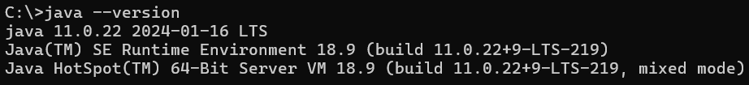
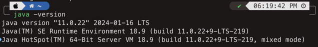
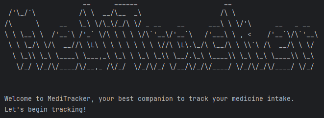

<!-- 
CREDIT: We try to follow the ideas and structure of the following sample user guide:
https://se-education.org/addressbook-level3/UserGuide.html
-->

# MediTracker User Guide
# Introduction
MediTracker is a desktop app for users who want to track their medication intake on a daily basis. It offers intuitive
features that works seamlessly right from the very beginning. With MediTracker, you do not have to worry about missing
your daily medication dose. It tracks your daily intake and reminds you when your remaining amount is low, and enables
data storage so that you can review your past medication intake.
<br>
<div style="display: flex; justify-content: space-between; position: fixed; bottom: 0; left: 0; width: 100%;">
    <div>
        <a href="#command-summary">:arrow_up_down: Jump to Command Summary</a>
    </div>
    <div>
        <a href="#table-of-contents">:arrow_up_down: Jump to Table of Contents</a>
    </div>
</div>
<div style="page-break-after: always;"></div>

# Table of Contents
Here are the comprehensive sections which MediTracker has to offer:
<!-- TOC -->
* [MediTracker User Guide](#meditracker-user-guide)
* [Introduction](#introduction)
* [Table of Contents](#table-of-contents)
* [How to Use the User Guide](#how-to-use-the-user-guide)
* [Quick Start](#quick-start)
* [Features](#features)
  * [Adding a medication `add`](#adding-a-medication-add)
  * [Listing medications `list`](#listing-medications-list)
    * [All medications](#all-medications)
    * [Daily medications](#daily-medications)
  * [Viewing medications `view`](#viewing-medications-view)
    * [View Medication by index](#view-medication-by-index)
    * [View Medication by name](#view-medication-by-name)
    * [View Medication by quantity](#view-medication-by-quantity)
    * [View Medication by expiry](#view-medication-by-expiry)
    * [View Medication by remarks](#view-medication-by-remarks)
  * [Record taking of medication](#record-taking-of-medication)
    * [Take Medication `take -l`](#take-medication-take--l)
    * [Untake Medication `untake -l`](#untake-medication-untake--l)
  * [Modify Medication Information `modify -l`](#modify-medication-information-modify--l)
  * [Delete Medication `delete -l`](#delete-medication-delete--l)
  * [Search](#search)
  * [Help](#help)
  * [General Data Management](#general-data-management)
    * [Saving to a file `save`](#saving-to-a-file-save)
    * [Reading from a file `load`](#reading-from-a-file-load)
    * [Editing the file](#editing-the-file)
  * [Setting an arbitrary time](#setting-an-arbitrary-time)
  * [Exit `exit`](#exit-exit)
* [Future Developments](#future-developments)
* [FAQ](#faq)
* [Glossary](#glossary)
* [Command Summary](#command-summary)
<!-- TOC -->

<br>

<div style="page-break-after: always;"></div>

# How to Use the User Guide
<!-- @@author annoy-o-mus-reused
reused from: https://ay2223s1-cs2103t-w16-2.github.io/tp/UserGuide.html#admonition-boxes
with minor modifications
-->
Throughout this guide, you may find coloured boxes containing highlighted pieces of text.
They are admonitions to help you take note of the content within.

| **Symbol**           | **Representation** | **Meaning**                                                                                  |
|----------------------|--------------------|----------------------------------------------------------------------------------------------|
| :notebook:           | Note               | Something you should keep in mind.                                                           
| :bulb:               | Tip                | Something you might find useful.                                                             |
| :information_source: | Info               | Something you might find useful for the particular context.                                  |
| :warning:            | Warning            | Something that you should pay close attention to.                                            |
| :bangbang:           | Danger             | Something you you must pay attention to. There is a risk of program failure if not followed. |

<!-- @@author -->
Below are some examples of highlighted pieces of text:

<div class="note-box">
:notebook: <strong>Note: </strong>
A note to take note.
</div>

<div class="tip-box">
:bulb: <strong>Tip: </strong>
A useful tip.
</div>

<div class="info-box">
:information_source: <strong>Info: </strong>
Some informative text.
</div>

<div class="warning-box">
:warning: <strong>Warning: </strong>
Important text.
</div>

<div class="danger-box">
:bangbang: <strong>Danger: </strong>
Extremely important text.
</div>
<br>

<div style="page-break-after: always;"></div>

# Quick Start
1. Ensure that you have [Java 11](https://docs.oracle.com/en/java/javase/11/install/overview-jdk-installation.html) 
or above installed. 
   - If you are using Windows:
     - Press the `Windows Key` on your keyboard and enter `Command Prompt` or `cmd` and press enter.
     - When the program opens, enter `java -version`.
   - If Java 11 is installed, you should get an output similar to below:<br>
     <br>
   - If you are using macOS/Linux:
     - Open the `Terminal`, then enter `java -version`.
   - If Java 11 is installed, you should get an output similar to below:<br>
     <br>
   - If you see otherwise, please follow the instructions from [here](https://docs.oracle.com/en/java/javase/11/install/overview-jdk-installation.html#GUID-8677A77F-231A-40F7-98B9-1FD0B48C346A).
2. Once that is settled, head over to the [link](https://github.com/AY2324S2-CS2113T-T09-1/tp/releases/latest) to obtain the latest version of `MediTracker`.
3. Save the file in an empty folder in `Desktop`, then this will be your home folder for `MediTracker`.
4. Open up a Command Prompt/Terminal. 
   - You can use `cd` to navigate to the folder where you have saved the program in
   - Then enter `java -jar meditracker.jar` to start the app.
   - If MediTracker has run successfully, you should see the following:<br>
   

<br>

<div style="page-break-after: always;"></div>

# Features

NOTES about the command format:
- Each command starts with a command keyword
- Following which, you may specify additional options
- These options can be in round brackets `()` (which are mandatory arguments) and in square brackets `[]` (which are
optional arguments)
- Each option are specified with either just its flag (which is of the form `-*` where `*` signifies some alphabetic 
characters), or the flag coupled with a value

  
<div class="tip-box">
:bulb: <strong>Tip: </strong>
If you forget how to use each command, simply entering just the command word will display the help message with all its 
usage and option(s).
</div>

<br>

<div style="page-break-after: always;"></div>

## Adding a medication `add`

Adds a medication to the medication manager.

```
Usage:
	add (-n name) (-q quantity) (-e expirationDate) (-dM dosageMorning)
	(-dA dosageAfternoon) (-dE dosageEvening) (-rep repeat) [-r remarks]
	[-h]
Options:
	-n name                 Name of medication
	-q quantity             Quantity of medication
	-e expirationDate       Expiration date of medication
	-dM dosageMorning       Morning dosage of medication
	-dA dosageAfternoon     Afternoon dosage of medication
	-dE dosageEvening       Evening dosage of medication
	-rep repeat             How often to take medication
	                            (eg: Supply a number from 1 to 7)
	-r remarks              Additional remarks on medication
	-h                      Prints this help message
```

<div class="tip-box">
:bulb: <strong>Tip: </strong>
  <ul>
    <li>The remarks tag is optional.</li>
    <li>The expiration date must be in yyyy-MM-dd format.</li>
    <li>You should only specify numerical values for quantity and dosages. Specifying them with units, 
        such as mg/ml, will not be accepted as valid input.</li>
  </ul>
</div>

<div class="note-box">
:notebook: <strong>Note: </strong>
Remarks will default to Nil if it is not specified.
</div>

Examples:

* `meditracker> add -n Medication A -q 5000 -e 2025-07-01 -dM 500 -dA 250 -dE 100 -rep 1 -r cause_dizziness`
* `meditracker> add -n Medication B -q 1000 -e 2024-09-30 -dM 500 -dA 250 -dE 50 -rep 6`

Output:
```
SUCCESS: Medicine has been added
```

<br>

<div style="page-break-after: always;"></div>

## Listing medications `list`

You can show the medications that you have added to the medication list, 
and show the medications that you will be taking for the day.

```
Usage:
	list (-t listType) [-m] [-a] [-e] [-h]
Options:
	-t listType     Lists medications accordingly
	-m              Time of day: Morning
	-a              Time of day: Afternoon
	-e              Time of day: Evening
	-h              Prints this help message
```
<br>

### All medications
Displays the whole lists of medications that you have added to the medication list.

Example: `meditracker> list -t all`

Output:
```
You have 2 medications listed below.
   Name                           Quantity   Expiry       Remarks
1. Medication A                   5000.0     2025-07-01   cause_dizziness
2. Medication B                   1000.0     2024-09-30   Nil
Your list of medications has been successfully shown!
```

<br>

<div style="page-break-after: always;"></div>

### Daily medications
Displays an overview of the list of medications that you will be taking for the day.

Example: `meditracker> list -t today`

Output:
```
Here are the Daily Medications you have to take today: 
Morning:
	1. [ ] Medication A | 500.0
	2. [ ] Medication B | 500.0
Afternoon:
	1. [ ] Medication A | 250.0
	2. [ ] Medication B | 250.0
Evening:
	1. [ ] Medication A | 100.0
	2. [ ] Medication B | 50.0
```

* If you want to specify a particular period of the day, simply enter `list -t today` followed by:
  * `-m`: Morning (Midnight to 12 Noon)
  * `-a`: Afternoon (12pm to 6pm)
  * `-e`: Evening (6pm to Midnight)

Example: `meditracker> list -t today -m` will display the list of medications to be taken in the morning only

Output:
```
Here are the Daily Medications you have to take today: 
Morning:
	1. [ ] Medication A | 500.0
	2. [ ] Medication B | 500.0
```

<div class="info-box">
:information_source: <strong>Info: </strong>

If you want to mark the medication you have taken, you can refer to the <a href="#take-medication-take--l"><code>Take 
Command</code></a>.

</div>

<br>

<div style="page-break-after: always;"></div>

## Viewing medications `view`
You can view detailed information about the medications you have added in the medication list.

```
Usage:
	view [-l listIndex] [-n name] [-q quantity] [-e expirationDate] 
	[-r remarks] [-h]
Options:
	-l listIndex          Index of item in list
	-n name               Name of medication
	-q quantity           Quantity of medication
	-e expirationDate     Expiration date of medication
	-r remarks            Additional remarks on medication
	-h                    Prints this help message
```

<div class="info-box">
:information_source: <strong>Info: </strong>

Perform <a href="#all-medications"><code>list -t all</code></a> first to display the lists of medications
in medication list and use its fields for the features below.

</div>

<div class="warning-box">
:warning: <strong>Warning: </strong>

You are only allowed to use one flag and argument.

</div>

This output will be shown if you used more than one flag and argument.
```
ERROR: You can only have one flag!
```

<br>

<div style="page-break-after: always;"></div>

### View Medication by index
By using the index shown in the medication list [`list -t all`](#all-medications), 
you can see all the fields of that medication index.

Format: `view -l MEDICATION_INDEX`

<div class="tip-box">
:bulb: <strong>Tip: </strong>
You are only allowed to use one flag and argument.
</div>

Example: `meditracker> view -l 1`

Output:
```
Name: Medication A
Quantity: 5000.0
Expiry Date: 2025-07-01
Remarks: cause_dizziness
Morning Dosage: 500.0
Afternoon Dosage: 250.0
Evening Dosage: 100.0
Repeat: 1

SUCCESS: Medication details has been retrieved
```

<br>

<div style="page-break-after: always;"></div>

### View Medication by name
You can view all medication information by its name.

Format: `view -n MEDICATION_NAME`

<div class="tip-box">
:bulb: <strong>Tip: </strong>
You are only allowed to use one flag and argument.
</div>

Example: `meditracker> view -n Medication B`

Output:
```
Name: Medication B
Quantity: 1000.0
Expiry Date: 2024-09-30
Remarks: Nil
Morning Dosage: 500.0
Afternoon Dosage: 250.0
Evening Dosage: 50.0
Repeat: 6

SUCCESS: Medication details has been retrieved
```

<br>

<div style="page-break-after: always;"></div>

### View Medication by quantity
You can view all medication information by its quantity.

Format: `view -q MEDICATION_QUANTITY`

<div class="tip-box">
:bulb: <strong>Tip: </strong>
You are only allowed to use one flag and argument.
</div>

Example: `meditracker> view -q 1000`

Output:
```
Name: Medication B
Quantity: 1000.0
Expiry Date: 2024-09-30
Remarks: Nil
Morning Dosage: 500.0
Afternoon Dosage: 250.0
Evening Dosage: 50.0
Repeat: 6

SUCCESS: Medication details has been retrieved
```

<br>

<div style="page-break-after: always;"></div>


### View Medication by expiry
You can view all medication information by its expiry year.

Format: `view -e MEDICATION_EXPIRY_IN_YYYY`

<div class="tip-box">
:bulb: <strong>Tip: </strong>
You are only allowed to use one flag and argument.
</div>

Example: `meditracker> view -e 2025`

Output:
```
Name: Medication A
Quantity: 5000.0
Expiry Date: 2025-07-01
Remarks: cause_dizziness
Morning Dosage: 500.0
Afternoon Dosage: 250.0
Evening Dosage: 100.0
Repeat: 1

Name: Medication B
Quantity: 1000.0
Expiry Date: 2024-09-30
Remarks: Nil
Morning Dosage: 500.0
Afternoon Dosage: 250.0
Evening Dosage: 50.0
Repeat: 6

SUCCESS: Medication details has been retrieved
```

<br>

<div style="page-break-after: always;"></div>

### View Medication by remarks
You can view all medication information by its remarks.

Format: `view -r MEDICATION_REMARKS`

<div class="tip-box">
:bulb: <strong>Tip: </strong>
You are only allowed to use one flag and argument.
</div>

Example: `meditracker> view -r dizziness`

Output:
```
Name: Medication A
Quantity: 5000.0
Expiry Date: 2025-07-01
Remarks: cause_dizziness
Morning Dosage: 500.0
Afternoon Dosage: 250.0
Evening Dosage: 100.0
Repeat: 1

SUCCESS: Medication details has been retrieved
```

<br>

<div style="page-break-after: always;"></div>

## Record taking of medication

### Take Medication `take -l`
When you have taken your medication, you can type `take`, followed by the list index `-l listIndex` to mark it as taken.
You can obtain the list index by entering [`list -t today`](#daily-medications) and refer to the index for the 
medication you have taken. This command is time aware and will mark the index you specified based on what time of day 
it is. 

<div class="tip-box">
:bulb: <strong>Tip: </strong>
Optionally, you can specify <code>-m</code>, <code>-a</code>, <code>-e</code> to override the time aware feature.
</div>

```
Usage:
	take (-l listIndex) [-m] [-a] [-e] [-h]
Options:
	-l listIndex     Index of item in list
	-m               Time of day: Morning
	-a               Time of day: Afternoon
	-e               Time of day: Evening
	-h               Prints this help message
```

Examples:

* `meditracker> take -l 1`
* `meditracker> take -l 1 -m`

Output:
```
INFO: Medication quantity decreased: 40.0 -> 38.0
SUCCESS: Medicine has been taken
```

<br>

<div style="page-break-after: always;"></div>

### Untake Medication `untake -l`
If you have accidentally entered the wrong command and wish to un-take the medication, you can type `untake`, 
followed by the list index `-l listIndex`. Similarly, you can obtain the list index by entering 
[`list -t today`](#daily-medications) and refer to the index for the medication you wish to un-mark. This command is 
time aware and will mark the index of the medication based on what time of day it is. 

<div class="tip-box">
:bulb: <strong>Tip: </strong>
Optionally, you can specify <code>-m</code>, <code>-a</code>, <code>-e</code> to override the time aware feature.
</div>

```
Usage:
	untake (-l listIndex) [-m] [-a] [-e] [-h]
Options:
	-l listIndex     Index of item in list
	-m               Time of day: Morning
	-a               Time of day: Afternoon
	-e               Time of day: Evening
	-h               Prints this help message
```

Examples: 

* `meditracker> untake -l 1`
* `meditracker> untake -l 1 -m`

Output:
```
INFO: Medication quantity increased: 38.0 -> 40.0
SUCCESS: Medicine has been untaken
```

<br>

<div style="page-break-after: always;"></div>

## Modify Medication Information `modify -l`
If you require modification to the medication information, you can type `modify`, followed by the list index
`-l listIndex`. You can obtain the list index from the Medication List by entering [`list -t all`](#all-medications).


<div class="tip-box">
:bulb: <strong>Tip: </strong>
  <ul>
    <li>This command allows multiple flags to be specified in one line.
        (For each of the fields that you would like to modify, you can specify the corresponding flag and 
        the new value to make changes.)</li>
    <li>You should only specify numerical values for quantity and dosages. Specifying them with units, 
        such as mg/ml, will not be accepted as valid input.</li>
  </ul>
</div>

<div class="warning-box">
:warning: <strong>Warning: </strong>
New dosage and/or repeat frequency will be applied tomorrow/next time you require 
to take the medication (whichever occurs later). No changes will be made to today's list of 
medication to take.
</div>

```
Usage:
	modify (-l listIndex) [-n name] [-q quantity] [-e expirationDate] 
	[-dM dosageMorning] [-dA dosageAfternoon] [-dE dosageEvening] 
	[-rep repeat] [-r remarks] [-h]
Options:
	-l listIndex            Index of item in list
	-n name                 Name of medication
	-q quantity             Quantity of medication
	-e expirationDate       Expiration date of medication
	-dM dosageMorning       Morning dosage of medication
	-dA dosageAfternoon     Afternoon dosage of medication
	-dE dosageEvening       Evening dosage of medication
	-rep repeat             How often to take medication
	                            (eg: Supply a number from 1 to 7)
	-r remarks              Additional remarks on medication
	-h                      Prints this help message
```
Examples:

* `meditracker> modify -l 1 -n MedB`
* `meditracker> modify -l 1 -q 40 -dA 2`

Output:
```
SUCCESS: Medicine has been modified
```

<br>

<div style="page-break-after: always;"></div>

## Delete Medication `delete -l`

To delete a medication, you can type `delete`, followed by the list index `-l listIndex`. 
You can obtain the list index by entering [`list -t all`](#all-medications) to refer to the list of all medications.

<div class="danger-box">
:bangbang: <strong>Danger: </strong>
This operation is irreversible. Once a medication is deleted, it cannot be restored back. Proceed with caution.
</div>

```
Usage:
	delete (-l listIndex) [-h]
Options:
	-l listIndex     Index of item in list
	-h               Prints this help message
```

Example: `meditracker> delete -l 2`

Output:
```
SUCCESS: Medicine has been deleted
```

<br>

<div style="page-break-after: always;"></div>

## Search

MediTracker has a built-in medication library where you can search for common medications. This library contains 
information on the medication name, the illness that the medication is used for, and the side effects of the medication.

<div class="note-box">
:notebook: <strong>Note: </strong>
The search command searches for medications from the built-in medication library, which is different from your personal 
medication list.
</div>

To search for a medication in the library, you can type 'search', followed by the field you want to search for and the 
keyword.
You have to include at least one of the following flags: `-n`, `-i`, `-s`, `-a` to specify the field you want to 
search for.

```
Usage:
	search [-n name] [-i illness] [-s sideEffects] [-a allFields] [-h]
Options:
    -n name                 Name of medication
    -i illness              Illness that the medication is used for
    -s sideEffects          Side effects of the medication
    -a allFields            Search all fields (name, illness, side effects)
    -h                      Prints this help message
```
Examples:
- `search -n Medication A`: Search for medication with the name `Medication A`
- `search -i Headache`: Search for medication that treats `Headache`
- `search -s Dizziness`: Search for medication with side effect `Dizziness`
- `search -a keyword`: Search for `keyword` in all fields in the library (name, illness, side effect)

Output:
```
Here are the search results:
1. Medication A; Treats: Headache; May cause: Dizziness
2. Medication B; Treats: Fever; Side Effects: Dizziness
```

<br>

<div style="page-break-after: always;"></div>

## Help

If in any situation you are stuck while using MediTracker, please do not worry. The help command is specifically 
designed to guide users to use the MediTracker. All you need to do is to type in `help`.


Example: `meditracker> help`


Output:
```
Here are the commands you can use with MediTracker:

	exit      Exits MediTracker.
	help      Lists all available commands and their description.
	add       Adds a medication to the medication manager.
	view      Get information of a specific medication.
	modify    Modify medication information.
	list      Summary of medications for the day.
	delete    Delete medication information.
	search    Access medicine database.
	take      Record taking of medication.
	untake    Record untaking of medication.
	save      Saves the JSON file to the specified path.
	load      Loads the JSON file from the specified path.

For more details about each command, simply type in the command name.
```

<br>

<div style="page-break-after: always;"></div>

## General Data Management

### Saving to a file `save`

Saves the JSON file to the specified path.

```
Usage:
	save [-o saveFile] [-h]
Options:
	-o saveFile     File path (including .json extension) to save to
	-h              Prints this help message
```

Format: `save [-o saveFile]`

Examples:
- `save`: Save the file to the default location.
- `save -o data/testfolder/output.json`: Saves the file to specified location.

The default save location is `data/MediTrackerData.json`.
As far as possible, refrain from using spaces in the file path, especially with `-h` i.e. `path/to -h/`. 
This will trigger the help message to be displayed rather than processing the saving.

Also, ensure that the file does not end with a space or a dot (.); the file must end with `.json`.

Ensure that the folder you are going to write to has the proper access rights. Don't write to system folders; it will likely fail.

<div class="info-box">
:information_source: <strong>Info: </strong>
The <code>dailymed</code> folder will be created at the same level as that of the JSON file.
Keep both the folder structure and the file name as is as our loading functionality relies on this particular save format.
</div>

<br>

<div style="page-break-after: always;"></div>

### Reading from a file `load`
Loads the JSON files from the specified path.

```
Usage:
	load (-in loadFile) [-h]
Options:
	-in loadFile     File path (including .json extension) to load from
	-h               Prints this help message
```

Format: `load (-in loadFile)`

Examples:
- `load -in data/to/inputFile.json`

The default load location is `data/MediTrackerData.json`. This is done automatically when the program starts.
You should make sure that this file is present in the specified path. Alternatively, you can use the `load` command
to load the file.

As far as possible, refrain from using spaces in the file path, especially with `-h` i.e. `path/to -h/`.
This will trigger the help message to be displayed rather than processing the saving.

A prompt will then ask for your confirmation to overwrite existing data as an additional layer of safeguard.

<div class="info-box">
:information_source: <strong>Info: </strong>
The <code>dailymed</code> folder must be at the same level as that of the JSON file and the text file must be of format <code>YYYY--MM-DD.txt</code> or the program will fail to find the files needed to load 
to update the Daily Medications.
</div>

<div class="warning-box">
:warning: <strong>Warning: </strong>
Loading will overwrite existing running data, so be sure to save a copy first before deciding to overwrite.
See the part on <a href="#editing-the-file">Editing the File</a> for warnings on modifying the saved file.
</div>

<br>

<div style="page-break-after: always;"></div>

### Editing the file
The medication information are saved in a `.json` format while the daily medication information are saved
in the `.txt` format (two independent files). Advanced users can modify either files directly.

<div class="danger-box">
:bangbang: <strong>Danger: </strong>
If the changes to the data file makes either its format or some of the fields contained therein invalid,
MediTracker may:

<ol>
  <li>Discard all the data and start with a fresh state</li>
  <li>Tries to read some information, and fill in placeholder values for fields that fail to load, which may result in unexpected results </li>
  <li>Crash due to bad data.</li>
</ol>

Some kinds of modifications that can render a file invalid include: 
<ol>
  <li>Removing semicolons (:) from the JSON file</li>
  <li>Using NaN and large numbers (9999999999999)</li>
</ol>
</div>

> Therefore, only edit the file if you are confident you can update it correctly.

<div class="warning-box">
:warning: <strong>Warning: </strong>
If you edit valid data directly inside the <code>.json</code> file, you might have to <b>modify the text file &lt;TODAY_DATE&gt;.txt in 
data/dailymed/</b> as well. Otherwise, the next time MediTracker runs, it will continue to read the old data saved in the
&lt;TODAY_DATE&gt;.txt.
</div>

<div class="info-box">
:information_source: <strong>Info: </strong>
As mentioned earlier, <code>.json</code> and <code>.txt</code> store All Medications and Daily Medications independently of each other. 
Therefore, in the case of data corruption in one of the files, please be minded that `list -t all` might display empty, while 
`list -t today` might display its contents normally, or vice versa. Or if both files are corrupted, both commands might 
not display anything at all.
</div>

<br>

<div style="page-break-after: always;"></div>


## Setting an arbitrary time

This feature is intended for developers to test out the features. 
To make use of this feature, simply add the following flag and argument **before running the program** (not during the program execution itself)

Example: `java -jar meditracker.jar -sim 2024-01-01T13:00:00Z`

The `-sim` flag informs the program that a simulated time is expected. The supplied date and time must be of the format specified above,
or else the parser will return an error. The supplied time is of the format `YYYY-MM-DDTHH:MM:SSZ`

In the above example, it will set the time for the program to be **1 Jan 2024, 1pm**.

The time will be fixed and will not "move" once the time has been set.

<br>

<div style="page-break-after: always;"></div>

## Exit `exit`
A goodbye message is printed on the screen, and the program exits after.

Format: `exit`

Example: `meditracker> exit`

Output:
```
Thank you for using MediTracker. Hope to see you again!
```

<br>

<div style="page-break-after: always;"></div>

# Future Developments
- Support Different save file type (.csv)
- Better file path checks to differentiate Operating Systems
- Configuration File to change default file settings
- Show historical data of the list of medication taken daily (show records of medication taken in the past)


# FAQ
**Q**: How do I transfer my data to another computer? 

**A**: By default, all MediTracker-related data will be saved under the `data` folder. 
This folder resides at the same level as the `meditracker.jar` file.
To transfer the data, just copy/shift the `data` folder to the new computer, 
making sure it is at the same level as the `.jar` file.

<br>

**Q**: Why does the program keep returning "Invalid index specified"?

**A**: Please make sure you are referring to the correct list. MediTracker uses [`list -t all`](#all-medications)
and [`list -t today`](#daily-medications) commands to display all medications and medications to be taken for the day, 
respectively. You may also use the `<command> -h` to see how the command works.

<br>

**Q**: How do I reset the program?

**A**: While we have yet to implement a reset functionality, there is a workaround. You can just delete the files at the default save location and the program will start with a fresh state.

<br>

**Q**: Where is the default save location?

**A**: The `.json` file is by default saved under the `data` folder which you can find in the same folder as the program you are running on.
The `.txt` files containing daily information are located by default inside the `data/dailymed` folder

<br> 

<div style="page-break-after: always;"></div>

# Glossary

| Term  | Explanation                                                                                                                                                                                                   |
|-------|---------------------------------------------------------------------------------------------------------------------------------------------------------------------------------------------------------------|
| .json | JSON stands for JavaScript Object Notation, which is used to save **all** medications added by the user.                                                                                                      |
| .txt  | It represents a text file that contains plain text in the form of lines. <br/>Medications to be taken for a particular day is saved in the text file, and a new text file is created at the start of the day. |
| Flags | Most commands in MediTracker uses the flags with the "-" to recognise values within certain fields. Eg. `-n`, `-a`, `-l`, etc.                                                                                |

<br>

<div style="page-break-after: always;"></div>

# Command Summary
<!-- Markdown table is not suitable as it does not provide text wrapping -->

<table>
  <tr>
    <th>Action</th>
    <th>Commands</th>
  </tr>
  <tr>
    <td>Add</td>
    <td>
      Format: <br>
      <code>
        add (-n name) (-q quantity) (-e expirationDate) (-dM dosageMorning) <br> (-dA dosageAfternoon) 
        (-dE dosageEvening) (-rep repeat) [-r remarks] [-h]
      </code> <br><br>
      Example: <br>
      <code>
        add -n Medication A -q 5000 -e 01/07/25 -dM 500 -dA 250 -dE 100 <br> -r cause_dizziness -rep 1 
      </code>
    </td>
  </tr>
  <tr>
    <td>List</td>
    <td>
      Format: <br>
      <code>
      list (-t listType) [-m] [-a] [-e] [-h] 
      </code> <br><br>
      Example: <br><code>list -t all<br></code><code>list -t today</code>
    </td>
  </tr>
  <tr>
    <td>View</td>
    <td>
      Format: <br>
      <code>view [-l listIndex] [-n name] [-q quantity] [-e expirationDate] <br> [-r remarks] [-h]</code><br><br>
      Example: <br><code>view -l 1<br></code><code>view -n Medication B<br></code><code>view -q 1000<br></code><code>view -e 2025<br></code><code>view -r dizziness</code>
    </td>
  </tr>
  <tr>
    <td>Update</td>
    <td>
      Format: <br>
      <code>
        modify (-l listIndex) [-n name] [-q quantity] [-e expirationDate] <br> [-dM dosageMorning]
        [-dA dosageAfternoon] [-dE dosageEvening] [-rep repeat] [-r remarks] [-h]
      </code>
      <br><br>
      Example: <br><code>modify -l 1 -n MedB<br></code><code>modify -l 1 -q 40 -dA 2</code>
    </td>
  </tr>
  <tr>
    <td>Take</td>
    <td>
      Format: <br>
      <code>take (-l listIndex) [-m] [-a] [-e] [-h] </code><br><br>
      Example: <br><code>take -l 1<br></code><code>take -l 1 -m</code>
    </td>
  </tr>
  <tr>
    <td>Untake</td>
    <td>
      Format: <br>
      <code>untake (-l listIndex) [-m] [-a] [-e] [-h] </code><br><br>
      Example: <br><code>untake -l 1<br></code><code>untake -l 1 -m</code>
    </td>
  </tr>
  <tr>
    <td>Delete</td>
    <td>
      Format: <br>
      <code>delete (-l listIndex) [-h] </code><br><br>
      Example: <br><code>delete -l 2</code>
    </td>
  </tr>
  <tr>
    <td>Search</td>
    <td>
      Format: <br>
      <code>search [-n name] [-i illness] [-s sideEffects] [-a allFields] [-h] </code><br><br>
      Example: <br><code>search -n Medication A<br></code><code>search -i Headache</code>
    </td>
  </tr>
  <tr>
    <td>Help</td>
    <td>
      Format: <br>
      <code>help</code>
    </td>
  </tr>
  <tr>
    <td>Save</td>
    <td>
      Format: <br>
      <code>save [-o saveFile] [-h] </code><br><br>
      Example: <br><code>save<br></code><code>save -o data/testfolder/output.json</code>
    </td>
  </tr>
  <tr>
    <td>Load</td>
    <td>
      Format: <br>
      <code>load (-in loadFile) </code><br><br>
      Example: <br><code>load -in data/to/inputFile.json</code>
    </td>
  </tr>
  <tr>
    <td>Exit</td>
    <td>
      Format: <br>
      <code>exit</code>
    </td>
  </tr>
</table>
